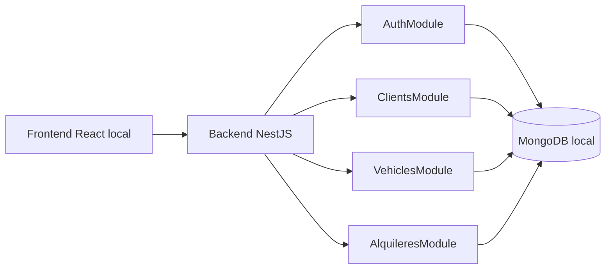
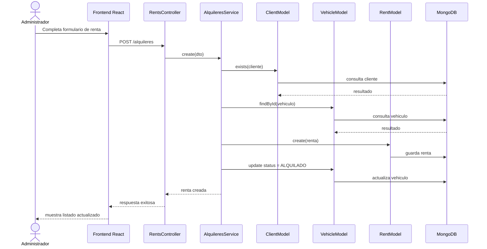
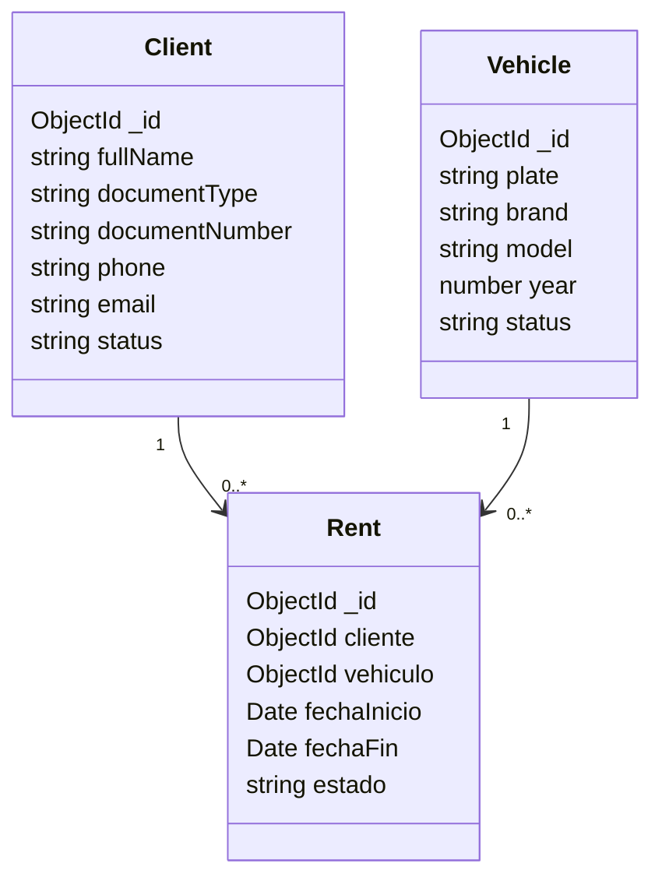

# Diagramas

## Diagrama de componentes

```mermaid
flowchart LR
  Frontend[Frontend React local] --> API[Backend NestJS]
  API --> Auth[AuthModule]
  API --> Clients[ClientsModule]
  API --> Vehicles[VehiclesModule]
  API --> Rents[AlquileresModule]
  Auth --> DB[(MongoDB local)]
  Clients --> DB
  Vehicles --> DB
  Rents --> DB
```

## Diagrama de flujo: crear renta

```mermaid
sequenceDiagram
  actor Admin as Administrador
  participant UI as Frontend React
  participant API as RentsController
  participant Service as AlquileresService
  participant Client as ClientModel
  participant Vehicle as VehicleModel
  participant Rent as RentModel
  participant DB as MongoDB

  Admin->>UI: Completa formulario de renta
  UI->>API: POST /alquileres
  API->>Service: create(dto)
  Service->>Client: exists(cliente)
  Client->>DB: consulta cliente
  DB-->>Client: resultado
  Service->>Vehicle: findById(vehiculo)
  Vehicle->>DB: consulta vehiculo
  DB-->>Vehicle: resultado
  Service->>Rent: create(renta)
  Rent->>DB: guarda renta
  Service->>Vehicle: update status = ALQUILADO
  Vehicle->>DB: actualiza vehiculo
  Service-->>API: renta creada
  API-->>UI: respuesta exitosa
  UI-->>Admin: muestra listado actualizado
```

## Diagrama de modelo de dominio

```mermaid
classDiagram
  class Client {
    ObjectId _id
    string fullName
    string documentType
    string documentNumber
    string phone
    string email
    string status
  }

  class Vehicle {
    ObjectId _id
    string plate
    string brand
    string model
    number year
    string status
  }

  class Rent {
    ObjectId _id
    ObjectId cliente
    ObjectId vehiculo
    Date fechaInicio
    Date fechaFin
    string estado
  }

  Client "1" --> "0..*" Rent
  Vehicle "1" --> "0..*" Rent
```
